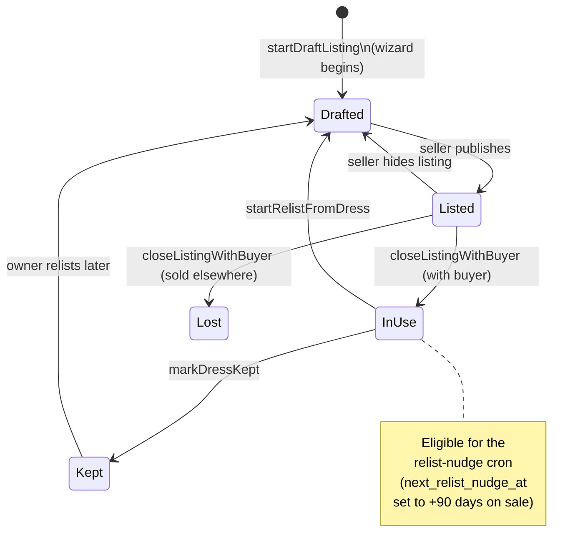
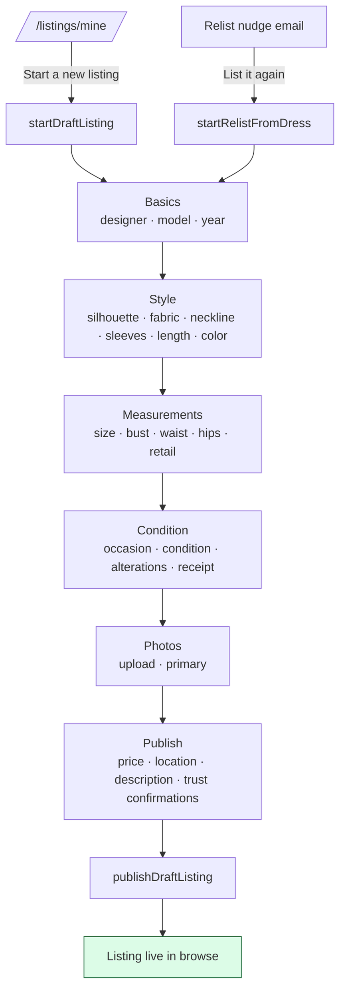
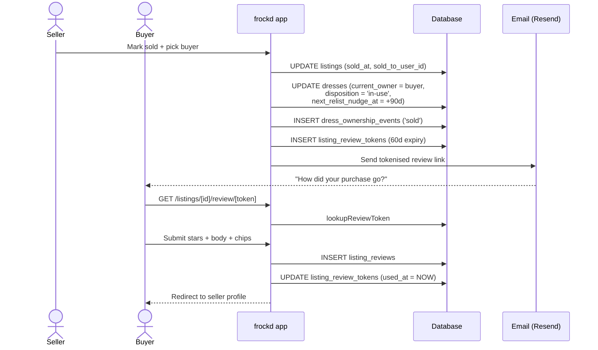
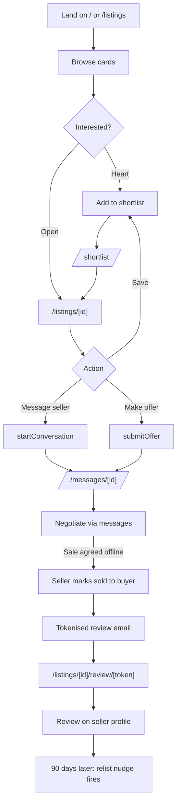
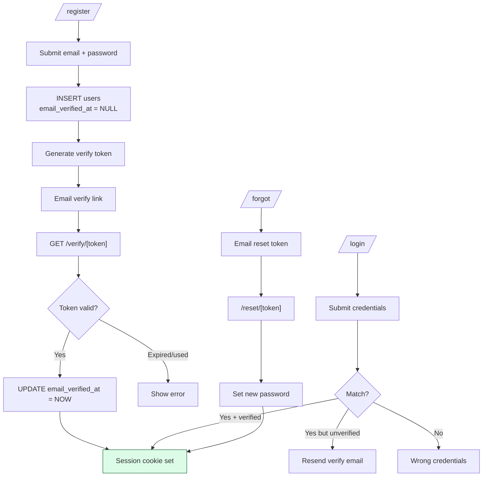
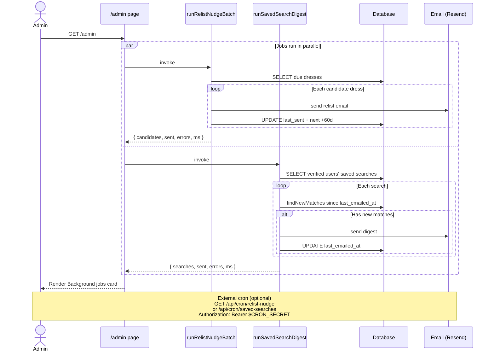
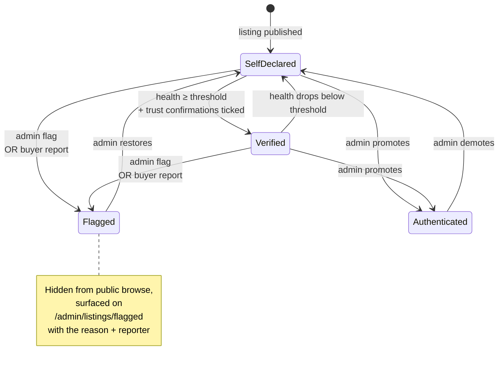

# frockd workflows

Mermaid diagrams covering the major user journeys and system flows. Render in
GitHub, the VSCode markdown preview (with the Mermaid extension), or any
Mermaid-aware viewer.

The dress-as-first-class refactor split a listing into two entities — a
**dress** (the physical garment, persistent across owners) and a **listing**
(one offering of that dress for sale). The flows below assume that model.

---

## 1. Dress lifecycle

State machine for `dresses.disposition`. The four underlying values are
`available`, `in-use`, `kept`, `lost`. The admin UI splits `available` into
two display states by checking for a live published listing — `Listed` (has
one) vs `Drafted` (no live listing yet).



The cron only fires for `disposition='in-use'`; once the buyer relists
(`Drafted`/`Listed`) or marks kept, nudges stop.

---

## 2. Listing wizard

Six-step flow for building or editing a listing. The wizard writes to
`dresses` (designer/silhouette/measurements) and `listings` (occasion/
condition/price/photos) in pair so each step persists immediately.



The relist entry point reuses the same wizard but skips dress creation —
physical attrs auto-fill from the existing `dresses` row, the new owner
re-enters listing-level fields (price, photos, condition).

---

## 3. Sale + review

Closing a listing with an attributed buyer kicks off three writes (listing,
dress, ownership event), issues a tokenised review link, and emails the buyer.



Sold-elsewhere (no buyer attributed) is the same shape minus the review token
and email; the dress goes to `disposition='lost'` instead of `'in-use'`.

---

## 4. Relist nudge

Time-triggered loop that turns one-shot sales into a circular marketplace.
Schedule is per-dress; rate-limited at the candidate-selection SQL.

```mermaid
flowchart TD
    Sale[Sale closed with buyer] -->|"+90 days scheduled"| Wait[Wait window]
    Wait --> Trigger{Cron run}
    Trigger -->|admin loads /admin| Run[runRelistNudgeBatch]
    Trigger -->|"GET /api/cron/relist-nudge<br/>(Bearer CRON_SECRET)"| Run
    Run --> Select["SELECT dresses<br/>disposition='in-use'<br/>+ nudge due<br/>+ last sent ≥ 60d ago<br/>+ owner verified"]
    Select --> Send[For each: sendRelistNudge]
    Send --> Email[Email owner]
    Send --> Roll[UPDATE last_sent + push next_nudge +60d]
    Email --> Land{Owner clicks link}
    Land -->|/dresses/[id]/relist| Pick{Owner picks}
    Pick -->|"List it again"| Available[startRelistFromDress<br/>disposition → 'available']
    Pick -->|"Keeping it"| Kept[markDressKept<br/>disposition → 'kept'<br/>nudge timestamps cleared]

    Force[Admin forces from /admin/dresses] -.->|forceRelistNudge| Send

    style Available fill:#cffafe,stroke:#155e75
    style Kept fill:#e0e7ff,stroke:#3730a3
```

The candidate filter is the rate limiter — refreshing /admin won't double-
email anyone.

---

## 5. Buy-side journey

End-to-end happy path for a buyer, from landing on the home page to leaving
a review after purchase.



The `NudgeLater` edge is what closes the loop into Flow #4 — the buyer
becomes a candidate seller of the same dress.

---

## 6. Auth

Standard email-verified registration + password reset. Sessions live in
cookies; tokens (verify, reset) live in DB tables with TTLs.



Suspended users (`suspended_at IS NOT NULL`) can sign in technically but
hit a maintenance-style wall on every protected route.

---

## 7. Background jobs (cron piggyback)

Both cron job bodies are extracted into `src/lib/cron/*` and run from two
places: an external scheduler hitting `/api/cron/...` with a Bearer token,
and the admin landing page itself, which awaits both on every load.



Per-row gates inside each job (the SQL filters) are the rate limiter, so
refreshing /admin doesn't re-send anything.

---

## 8. Trust + moderation

Listing trust state is `listings.trust_status` ∈
{`self-declared`, `verified`, `authenticated`, `flagged`}. Verified is
auto-elevated when a listing's health score crosses the configurable
threshold and both trust confirmations are ticked. Flagged is the
moderation queue.



`recomputeListingTrustStatus` runs inline on listing detail view and re-
evaluates the auto-verified path so the badge stays in sync without a
background job.
